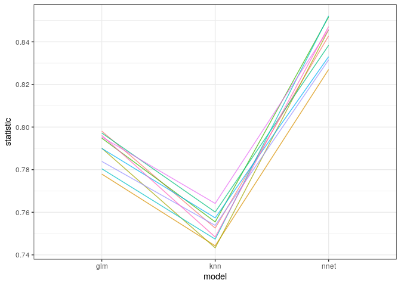
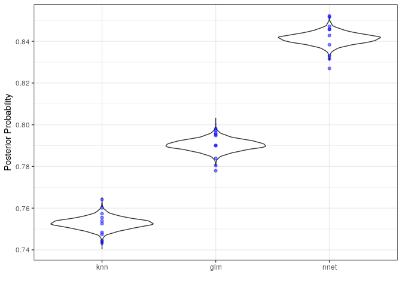
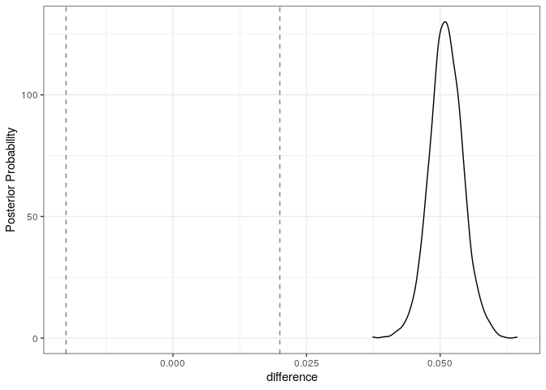

# Tidyposterior


see https://tidymodels.github.io/tidyposterior/articles/Getting_Started.html

<br><br>


```
## # A tibble: 10 x 4
##    id       glm   knn  nnet
##    <chr>  <dbl> <dbl> <dbl>
##  1 Fold01 0.798 0.753 0.843
##  2 Fold02 0.778 0.744 0.827
##  3 Fold03 0.790 0.743 0.846
##  4 Fold04 0.795 0.755 0.852
##  5 Fold05 0.797 0.760 0.838
##  6 Fold06 0.780 0.747 0.852
##  7 Fold07 0.790 0.757 0.833
##  8 Fold08 0.784 0.754 0.832
##  9 Fold09 0.795 0.764 0.846
## 10 Fold10 0.796 0.748 0.847
```


<!-- -->


```
## 
## SAMPLING FOR MODEL 'continuous' NOW (CHAIN 1).
## Chain 1: 
## Chain 1: Gradient evaluation took 2.9e-05 seconds
## Chain 1: 1000 transitions using 10 leapfrog steps per transition would take 0.29 seconds.
## Chain 1: Adjust your expectations accordingly!
## Chain 1: 
## Chain 1: 
## Chain 1: Iteration:    1 / 2000 [  0%]  (Warmup)
## Chain 1: Iteration:  200 / 2000 [ 10%]  (Warmup)
## Chain 1: Iteration:  400 / 2000 [ 20%]  (Warmup)
## Chain 1: Iteration:  600 / 2000 [ 30%]  (Warmup)
## Chain 1: Iteration:  800 / 2000 [ 40%]  (Warmup)
## Chain 1: Iteration: 1000 / 2000 [ 50%]  (Warmup)
## Chain 1: Iteration: 1001 / 2000 [ 50%]  (Sampling)
## Chain 1: Iteration: 1200 / 2000 [ 60%]  (Sampling)
## Chain 1: Iteration: 1400 / 2000 [ 70%]  (Sampling)
## Chain 1: Iteration: 1600 / 2000 [ 80%]  (Sampling)
## Chain 1: Iteration: 1800 / 2000 [ 90%]  (Sampling)
## Chain 1: Iteration: 2000 / 2000 [100%]  (Sampling)
## Chain 1: 
## Chain 1:  Elapsed Time: 1.32822 seconds (Warm-up)
## Chain 1:                0.100933 seconds (Sampling)
## Chain 1:                1.42915 seconds (Total)
## Chain 1: 
## 
## SAMPLING FOR MODEL 'continuous' NOW (CHAIN 2).
## Chain 2: 
## Chain 2: Gradient evaluation took 9e-06 seconds
## Chain 2: 1000 transitions using 10 leapfrog steps per transition would take 0.09 seconds.
## Chain 2: Adjust your expectations accordingly!
## Chain 2: 
## Chain 2: 
## Chain 2: Iteration:    1 / 2000 [  0%]  (Warmup)
## Chain 2: Iteration:  200 / 2000 [ 10%]  (Warmup)
## Chain 2: Iteration:  400 / 2000 [ 20%]  (Warmup)
## Chain 2: Iteration:  600 / 2000 [ 30%]  (Warmup)
## Chain 2: Iteration:  800 / 2000 [ 40%]  (Warmup)
## Chain 2: Iteration: 1000 / 2000 [ 50%]  (Warmup)
## Chain 2: Iteration: 1001 / 2000 [ 50%]  (Sampling)
## Chain 2: Iteration: 1200 / 2000 [ 60%]  (Sampling)
## Chain 2: Iteration: 1400 / 2000 [ 70%]  (Sampling)
## Chain 2: Iteration: 1600 / 2000 [ 80%]  (Sampling)
## Chain 2: Iteration: 1800 / 2000 [ 90%]  (Sampling)
## Chain 2: Iteration: 2000 / 2000 [100%]  (Sampling)
## Chain 2: 
## Chain 2:  Elapsed Time: 1.53798 seconds (Warm-up)
## Chain 2:                0.107929 seconds (Sampling)
## Chain 2:                1.64591 seconds (Total)
## Chain 2: 
## 
## SAMPLING FOR MODEL 'continuous' NOW (CHAIN 3).
## Chain 3: 
## Chain 3: Gradient evaluation took 1.1e-05 seconds
## Chain 3: 1000 transitions using 10 leapfrog steps per transition would take 0.11 seconds.
## Chain 3: Adjust your expectations accordingly!
## Chain 3: 
## Chain 3: 
## Chain 3: Iteration:    1 / 2000 [  0%]  (Warmup)
## Chain 3: Iteration:  200 / 2000 [ 10%]  (Warmup)
## Chain 3: Iteration:  400 / 2000 [ 20%]  (Warmup)
## Chain 3: Iteration:  600 / 2000 [ 30%]  (Warmup)
## Chain 3: Iteration:  800 / 2000 [ 40%]  (Warmup)
## Chain 3: Iteration: 1000 / 2000 [ 50%]  (Warmup)
## Chain 3: Iteration: 1001 / 2000 [ 50%]  (Sampling)
## Chain 3: Iteration: 1200 / 2000 [ 60%]  (Sampling)
## Chain 3: Iteration: 1400 / 2000 [ 70%]  (Sampling)
## Chain 3: Iteration: 1600 / 2000 [ 80%]  (Sampling)
## Chain 3: Iteration: 1800 / 2000 [ 90%]  (Sampling)
## Chain 3: Iteration: 2000 / 2000 [100%]  (Sampling)
## Chain 3: 
## Chain 3:  Elapsed Time: 1.51681 seconds (Warm-up)
## Chain 3:                0.129704 seconds (Sampling)
## Chain 3:                1.64652 seconds (Total)
## Chain 3: 
## 
## SAMPLING FOR MODEL 'continuous' NOW (CHAIN 4).
## Chain 4: 
## Chain 4: Gradient evaluation took 1e-05 seconds
## Chain 4: 1000 transitions using 10 leapfrog steps per transition would take 0.1 seconds.
## Chain 4: Adjust your expectations accordingly!
## Chain 4: 
## Chain 4: 
## Chain 4: Iteration:    1 / 2000 [  0%]  (Warmup)
## Chain 4: Iteration:  200 / 2000 [ 10%]  (Warmup)
## Chain 4: Iteration:  400 / 2000 [ 20%]  (Warmup)
## Chain 4: Iteration:  600 / 2000 [ 30%]  (Warmup)
## Chain 4: Iteration:  800 / 2000 [ 40%]  (Warmup)
## Chain 4: Iteration: 1000 / 2000 [ 50%]  (Warmup)
## Chain 4: Iteration: 1001 / 2000 [ 50%]  (Sampling)
## Chain 4: Iteration: 1200 / 2000 [ 60%]  (Sampling)
## Chain 4: Iteration: 1400 / 2000 [ 70%]  (Sampling)
## Chain 4: Iteration: 1600 / 2000 [ 80%]  (Sampling)
## Chain 4: Iteration: 1800 / 2000 [ 90%]  (Sampling)
## Chain 4: Iteration: 2000 / 2000 [100%]  (Sampling)
## Chain 4: 
## Chain 4:  Elapsed Time: 1.28838 seconds (Warm-up)
## Chain 4:                0.106051 seconds (Sampling)
## Chain 4:                1.39444 seconds (Total)
## Chain 4:
```

```
## stan_glmer
##  family:       gaussian [identity]
##  formula:      statistic ~ model + (1 | id)
##  observations: 30
## ------
##             Median MAD_SD
## (Intercept) 0.8    0.0   
## modelknn    0.0    0.0   
## modelnnet   0.1    0.0   
## 
## Auxiliary parameter(s):
##       Median MAD_SD
## sigma 0.0    0.0   
## 
## Error terms:
##  Groups   Name        Std.Dev.
##  id       (Intercept) 0.0044  
##  Residual             0.0070  
## Num. levels: id 10 
## 
## ------
## * For help interpreting the printed output see ?print.stanreg
## * For info on the priors used see ?prior_summary.stanreg
```


```
## # A tibble: 6 x 2
##   model posterior
## * <chr>     <dbl>
## 1 glm       0.790
## 2 glm       0.791
## 3 glm       0.789
## 4 glm       0.790
## 5 glm       0.791
## 6 glm       0.789
```

<!-- -->


# Contrast models


```
##   difference model_1 model_2
## 1    0.05272    nnet     glm
## 2    0.05122    nnet     glm
## 3    0.05221    nnet     glm
## 4    0.05128    nnet     glm
## 5    0.04948    nnet     glm
## 6    0.05113    nnet     glm
```

```
## # A tibble: 1 x 9
##   contrast probability   mean  lower  upper  size pract_neg pract_equiv
##   <chr>          <dbl>  <dbl>  <dbl>  <dbl> <dbl>     <dbl>       <dbl>
## 1 nnet vs…           1 0.0511 0.0461 0.0563  0.02         0           0
## # … with 1 more variable: pract_pos <dbl>
```

## THE ROPE

<!-- -->


<br> <br>

# Session Info


```
## ─ Session info ───────────────────────────────────────────────────────────────
##  setting  value                       
##  version  R version 3.6.2 (2019-12-12)
##  os       Pop!_OS 19.10               
##  system   x86_64, linux-gnu           
##  ui       X11                         
##  language en_US:en                    
##  collate  en_US.UTF-8                 
##  ctype    en_US.UTF-8                 
##  tz       America/Toronto             
##  date     2020-01-30                  
## 
## ─ Packages ───────────────────────────────────────────────────────────────────
##  package       * version    date       lib
##  assertthat      0.2.1      2019-03-21 [1]
##  backports       1.1.5      2019-10-02 [1]
##  base64enc       0.1-3      2015-07-28 [1]
##  bayesplot       1.7.1      2019-12-01 [1]
##  boot            1.3-24     2019-12-20 [4]
##  broom           0.5.4      2020-01-27 [1]
##  callr           3.4.1      2020-01-24 [1]
##  cellranger      1.1.0      2016-07-27 [1]
##  cli             2.0.1      2020-01-08 [1]
##  codetools       0.2-16     2018-12-24 [4]
##  colorspace      1.4-1      2019-03-18 [1]
##  colourpicker    1.0        2017-09-27 [1]
##  crayon          1.3.4      2017-09-16 [1]
##  crosstalk       1.0.0      2016-12-21 [1]
##  DBI             1.1.0      2019-12-15 [1]
##  dbplyr          1.4.2      2019-06-17 [1]
##  desc            1.2.0      2018-05-01 [1]
##  devtools        2.2.1      2019-09-24 [1]
##  digest          0.6.23     2019-11-23 [1]
##  dplyr         * 0.8.3      2019-07-04 [1]
##  DT              0.11       2019-12-19 [1]
##  dygraphs        1.1.1.6    2018-07-11 [1]
##  ellipsis        0.3.0      2019-09-20 [1]
##  evaluate        0.14       2019-05-28 [1]
##  fansi           0.4.1      2020-01-08 [1]
##  farver          2.0.3      2020-01-16 [1]
##  fastmap         1.0.1      2019-10-08 [1]
##  forcats       * 0.4.0      2019-02-17 [1]
##  fs              1.3.1      2019-05-06 [1]
##  furrr           0.1.0      2018-05-16 [1]
##  future          1.16.0     2020-01-16 [1]
##  generics        0.0.2      2018-11-29 [1]
##  ggplot2       * 3.2.1      2019-08-10 [1]
##  ggridges        0.5.2      2020-01-12 [1]
##  globals         0.12.5     2019-12-07 [1]
##  glue            1.3.1      2019-03-12 [1]
##  gridExtra       2.3        2017-09-09 [1]
##  gtable          0.3.0      2019-03-25 [1]
##  gtools          3.8.1      2018-06-26 [1]
##  haven           2.2.0      2019-11-08 [1]
##  hms             0.5.3      2020-01-08 [1]
##  htmltools       0.4.0      2019-10-04 [1]
##  htmlwidgets     1.5.1      2019-10-08 [1]
##  httpuv          1.5.2      2019-09-11 [1]
##  httr            1.4.1      2019-08-05 [1]
##  igraph          1.2.4.2    2019-11-27 [1]
##  inline          0.3.15     2018-05-18 [1]
##  jsonlite        1.6        2018-12-07 [1]
##  knitr           1.27       2020-01-16 [1]
##  labeling        0.3        2014-08-23 [1]
##  later           1.0.0      2019-10-04 [1]
##  lattice         0.20-38    2018-11-04 [4]
##  lazyeval        0.2.2      2019-03-15 [1]
##  lifecycle       0.1.0      2019-08-01 [1]
##  listenv         0.8.0      2019-12-05 [1]
##  lme4            1.1-21     2019-03-05 [1]
##  loo             2.2.0      2019-12-19 [1]
##  lubridate       1.7.4      2018-04-11 [1]
##  magrittr        1.5        2014-11-22 [1]
##  markdown        1.1        2019-08-07 [1]
##  MASS            7.3-51.5   2019-12-20 [4]
##  Matrix          1.2-18     2019-11-27 [4]
##  matrixStats     0.55.0     2019-09-07 [1]
##  memoise         1.1.0      2017-04-21 [1]
##  mime            0.8        2019-12-19 [1]
##  miniUI          0.1.1.1    2018-05-18 [1]
##  minqa           1.2.4      2014-10-09 [1]
##  modelr          0.1.5      2019-08-08 [1]
##  munsell         0.5.0      2018-06-12 [1]
##  nlme            3.1-143    2019-12-10 [4]
##  nloptr          1.2.1      2018-10-03 [1]
##  pillar          1.4.3      2019-12-20 [1]
##  pkgbuild        1.0.6      2019-10-09 [1]
##  pkgconfig       2.0.3      2019-09-22 [1]
##  pkgload         1.0.2      2018-10-29 [1]
##  plyr            1.8.5      2019-12-10 [1]
##  prettyunits     1.1.1      2020-01-24 [1]
##  processx        3.4.1      2019-07-18 [1]
##  promises        1.1.0      2019-10-04 [1]
##  ps              1.3.0      2018-12-21 [1]
##  purrr         * 0.3.3      2019-10-18 [1]
##  R6              2.4.1      2019-11-12 [1]
##  Rcpp            1.0.3      2019-11-08 [1]
##  readr         * 1.3.1      2018-12-21 [1]
##  readxl          1.3.1      2019-03-13 [1]
##  remotes         2.1.0      2019-06-24 [1]
##  reprex          0.3.0      2019-05-16 [1]
##  reshape2        1.4.3      2017-12-11 [1]
##  rlang           0.4.3      2020-01-24 [1]
##  rmarkdown       2.1        2020-01-20 [1]
##  rprojroot       1.3-2      2018-01-03 [1]
##  rsample         0.0.5      2019-07-12 [1]
##  rsconnect       0.8.16     2019-12-13 [1]
##  rstan           2.19.2     2019-07-09 [1]
##  rstanarm        2.19.2     2019-10-03 [1]
##  rstantools      2.0.0      2019-09-15 [1]
##  rstudioapi      0.10       2019-03-19 [1]
##  rvest           0.3.5      2019-11-08 [1]
##  scales          1.1.0      2019-11-18 [1]
##  sessioninfo     1.1.1      2018-11-05 [1]
##  shiny           1.4.0      2019-10-10 [1]
##  shinyjs         1.1        2020-01-13 [1]
##  shinystan       2.5.0      2018-05-01 [1]
##  shinythemes     1.1.2      2018-11-06 [1]
##  StanHeaders     2.19.0     2019-09-07 [1]
##  stringi         1.4.5      2020-01-11 [1]
##  stringr       * 1.4.0      2019-02-10 [1]
##  survival        3.1-8      2019-12-03 [4]
##  testthat        2.3.1      2019-12-01 [1]
##  threejs         0.3.3      2020-01-21 [1]
##  tibble        * 2.1.3      2019-06-06 [1]
##  tidyposterior * 0.0.2.9000 2020-01-30 [1]
##  tidyr         * 1.0.2      2020-01-24 [1]
##  tidyselect      0.2.5      2018-10-11 [1]
##  tidyverse     * 1.3.0      2019-11-21 [1]
##  usethis         1.5.1      2019-07-04 [1]
##  utf8            1.1.4      2018-05-24 [1]
##  vctrs           0.2.2      2020-01-24 [1]
##  withr           2.1.2      2018-03-15 [1]
##  xfun            0.12       2020-01-13 [1]
##  xml2            1.2.2      2019-08-09 [1]
##  xtable          1.8-4      2019-04-21 [1]
##  xts             0.12-0     2020-01-19 [1]
##  yaml            2.2.0      2018-07-25 [1]
##  zoo             1.8-7      2020-01-10 [1]
##  source                                   
##  CRAN (R 3.6.2)                           
##  CRAN (R 3.6.2)                           
##  CRAN (R 3.6.2)                           
##  CRAN (R 3.6.2)                           
##  CRAN (R 3.6.2)                           
##  CRAN (R 3.6.2)                           
##  CRAN (R 3.6.2)                           
##  CRAN (R 3.6.2)                           
##  CRAN (R 3.6.2)                           
##  CRAN (R 3.6.0)                           
##  CRAN (R 3.6.2)                           
##  CRAN (R 3.6.2)                           
##  CRAN (R 3.6.2)                           
##  CRAN (R 3.6.2)                           
##  CRAN (R 3.6.2)                           
##  CRAN (R 3.6.2)                           
##  CRAN (R 3.6.2)                           
##  CRAN (R 3.6.2)                           
##  CRAN (R 3.6.2)                           
##  CRAN (R 3.6.2)                           
##  CRAN (R 3.6.2)                           
##  CRAN (R 3.6.2)                           
##  CRAN (R 3.6.2)                           
##  CRAN (R 3.6.2)                           
##  CRAN (R 3.6.2)                           
##  CRAN (R 3.6.2)                           
##  CRAN (R 3.6.2)                           
##  CRAN (R 3.6.2)                           
##  CRAN (R 3.6.2)                           
##  CRAN (R 3.6.2)                           
##  CRAN (R 3.6.2)                           
##  CRAN (R 3.6.2)                           
##  CRAN (R 3.6.2)                           
##  CRAN (R 3.6.2)                           
##  CRAN (R 3.6.2)                           
##  CRAN (R 3.6.2)                           
##  CRAN (R 3.6.2)                           
##  CRAN (R 3.6.2)                           
##  CRAN (R 3.6.2)                           
##  CRAN (R 3.6.2)                           
##  CRAN (R 3.6.2)                           
##  CRAN (R 3.6.2)                           
##  CRAN (R 3.6.2)                           
##  CRAN (R 3.6.2)                           
##  CRAN (R 3.6.2)                           
##  CRAN (R 3.6.2)                           
##  CRAN (R 3.6.2)                           
##  CRAN (R 3.6.2)                           
##  CRAN (R 3.6.2)                           
##  CRAN (R 3.6.2)                           
##  CRAN (R 3.6.2)                           
##  CRAN (R 3.6.0)                           
##  CRAN (R 3.6.2)                           
##  CRAN (R 3.6.2)                           
##  CRAN (R 3.6.2)                           
##  CRAN (R 3.6.2)                           
##  CRAN (R 3.6.2)                           
##  CRAN (R 3.6.2)                           
##  CRAN (R 3.6.2)                           
##  CRAN (R 3.6.2)                           
##  CRAN (R 3.6.2)                           
##  CRAN (R 3.6.1)                           
##  CRAN (R 3.6.2)                           
##  CRAN (R 3.6.2)                           
##  CRAN (R 3.6.2)                           
##  CRAN (R 3.6.2)                           
##  CRAN (R 3.6.2)                           
##  CRAN (R 3.6.2)                           
##  CRAN (R 3.6.2)                           
##  CRAN (R 3.6.2)                           
##  CRAN (R 3.6.2)                           
##  CRAN (R 3.6.2)                           
##  CRAN (R 3.6.2)                           
##  CRAN (R 3.6.2)                           
##  CRAN (R 3.6.2)                           
##  CRAN (R 3.6.2)                           
##  CRAN (R 3.6.2)                           
##  CRAN (R 3.6.2)                           
##  CRAN (R 3.6.2)                           
##  CRAN (R 3.6.2)                           
##  CRAN (R 3.6.2)                           
##  CRAN (R 3.6.2)                           
##  CRAN (R 3.6.2)                           
##  CRAN (R 3.6.2)                           
##  CRAN (R 3.6.2)                           
##  CRAN (R 3.6.2)                           
##  CRAN (R 3.6.2)                           
##  CRAN (R 3.6.2)                           
##  CRAN (R 3.6.2)                           
##  CRAN (R 3.6.2)                           
##  CRAN (R 3.6.2)                           
##  CRAN (R 3.6.2)                           
##  CRAN (R 3.6.2)                           
##  CRAN (R 3.6.2)                           
##  CRAN (R 3.6.2)                           
##  CRAN (R 3.6.2)                           
##  CRAN (R 3.6.2)                           
##  CRAN (R 3.6.2)                           
##  CRAN (R 3.6.2)                           
##  CRAN (R 3.6.2)                           
##  CRAN (R 3.6.2)                           
##  CRAN (R 3.6.2)                           
##  CRAN (R 3.6.2)                           
##  CRAN (R 3.6.2)                           
##  CRAN (R 3.6.2)                           
##  CRAN (R 3.6.2)                           
##  CRAN (R 3.6.2)                           
##  CRAN (R 3.6.2)                           
##  CRAN (R 3.6.2)                           
##  CRAN (R 3.6.2)                           
##  CRAN (R 3.6.2)                           
##  Github (tidymodels/tidyposterior@6b60286)
##  CRAN (R 3.6.2)                           
##  CRAN (R 3.6.2)                           
##  CRAN (R 3.6.2)                           
##  CRAN (R 3.6.2)                           
##  CRAN (R 3.6.2)                           
##  CRAN (R 3.6.2)                           
##  CRAN (R 3.6.2)                           
##  CRAN (R 3.6.2)                           
##  CRAN (R 3.6.2)                           
##  CRAN (R 3.6.2)                           
##  CRAN (R 3.6.2)                           
##  CRAN (R 3.6.2)                           
##  CRAN (R 3.6.2)                           
## 
## [1] /home/sahir/R/x86_64-pc-linux-gnu-library/3.6
## [2] /usr/local/lib/R/site-library
## [3] /usr/lib/R/site-library
## [4] /usr/lib/R/library
```

<br> <br>

# References
