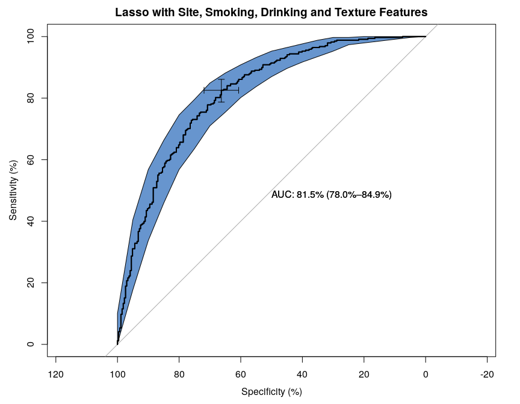

Here I produce the equivalent coefficient plots for the logistic lasso regression with glmnet [@R-glmnet]. There are mainly two ways to select the tuning parameter. I present both, which is based on 10-Fold cross validation. 


```r
source(here::here("analysis/bin/packages.R"))
source(here::here("analysis/bin/functions.R"))
source(here::here("analysis/bin/data.R"))
```


```r
fmla <- as.formula(paste("NodalStage ~ Smoking + Drinking + TstageGroup + ",
                         paste(texture_names, collapse = "+") ))
framed <- model_frame(fmla, DT_final)
hardhat <- model_matrix(framed$terms,framed$data)
Y <- as.numeric(framed$data$NodalStage) - 1
XX <- glmnet::makeX(train = DT_final[,texture_names,with=F], na.impute = FALSE)
```

# Variable Selection


```r
cvfit <- cv.glmnet(x = XX,y = Y, family = "binomial")
coef_1se <- data.frame(feature = names(coef(cvfit, s = "lambda.1se")[-1,]),
                       `coefficient estimate` =  coef(cvfit, s = "lambda.1se")[-1,])
coef_min <- data.frame(feature = names(coef(cvfit, s = "lambda.min")[-1,]),
                       `coefficient estimate` =  coef(cvfit, s = "lambda.min")[-1,])


ggplot() +
  geom_point(data = coef_1se, mapping = aes(x = feature, y = `coefficient.estimate`)) +
  theme(axis.text.x = element_text(angle = 90)) +
  labs(title = "Lasso solution based on 10-Fold CV and lambda.1se",
       subtitle = "Nodal Stage prediction using logistic regression with texture features only")
```

<!-- -->

```r
ggplot() +
  geom_point(data = coef_min, mapping = aes(x = feature, y = `coefficient.estimate`)) +
  theme(axis.text.x = element_text(angle = 90)) +
  labs(title = "Lasso solution based on 10-Fold CV and lambda.min",
       subtitle = "Nodal Stage prediction using logistic regression with texture features only")
```

<!-- -->


# Prediction Performance

Here I provide the prediction performance. Likely overfit because the training set is also used as the test set. 


```r
glmnet::confusion.glmnet(cvfit, newx = XX, newy = Y)
```

```
##          True
## Predicted   0   1 Total
##     0     136  57   193
##     1     131 281   412
##     Total 267 338   605
## 
##  Percent Correct:  0.689
```

```r
tt <- glmnet::roc.glmnet(cvfit, newx = XX, newy = Y)
plot(tt[,1],tt[,2], type = "l",
     main = sprintf("AUC of %.3f",
                    glmnet::assess.glmnet(cvfit, newx = XX, newy = Y)$auc),
     xlab = "False Positive Rate",
     ylab = "True Positive Rate")
abline(a=0, b=1)
```

<!-- -->


<br> <br>

# Session Info


```r
devtools::session_info()
```

```
## ─ Session info ───────────────────────────────────────────────────────────────
##  setting  value                       
##  version  R version 3.6.2 (2019-12-12)
##  os       Pop!_OS 19.10               
##  system   x86_64, linux-gnu           
##  ui       X11                         
##  language en_US:en                    
##  collate  en_US.UTF-8                 
##  ctype    en_US.UTF-8                 
##  tz       America/Toronto             
##  date     2020-03-18                  
## 
## ─ Packages ───────────────────────────────────────────────────────────────────
##  package     * version    date       lib source                            
##  assertthat    0.2.1      2019-03-21 [1] CRAN (R 3.6.2)                    
##  backports     1.1.5      2019-10-02 [1] CRAN (R 3.6.2)                    
##  broom         0.5.4      2020-01-27 [1] CRAN (R 3.6.2)                    
##  callr         3.4.2      2020-02-12 [1] CRAN (R 3.6.2)                    
##  cellranger    1.1.0      2016-07-27 [1] CRAN (R 3.6.2)                    
##  cli           2.0.2      2020-02-28 [1] CRAN (R 3.6.2)                    
##  codetools     0.2-16     2018-12-24 [4] CRAN (R 3.6.0)                    
##  colorspace    1.4-1      2019-03-18 [1] CRAN (R 3.6.2)                    
##  crayon        1.3.4      2017-09-16 [1] CRAN (R 3.6.2)                    
##  data.table  * 1.12.8     2019-12-09 [1] CRAN (R 3.6.2)                    
##  DBI           1.1.0      2019-12-15 [1] CRAN (R 3.6.2)                    
##  dbplyr        1.4.2      2019-06-17 [1] CRAN (R 3.6.2)                    
##  desc          1.2.0      2018-05-01 [1] CRAN (R 3.6.2)                    
##  devtools      2.2.2      2020-02-17 [1] CRAN (R 3.6.2)                    
##  digest        0.6.25     2020-02-23 [1] CRAN (R 3.6.2)                    
##  doParallel    1.0.15     2019-08-02 [1] CRAN (R 3.6.2)                    
##  dplyr       * 0.8.4      2020-01-31 [1] CRAN (R 3.6.2)                    
##  ellipsis      0.3.0      2019-09-20 [1] CRAN (R 3.6.2)                    
##  evaluate      0.14       2019-05-28 [1] CRAN (R 3.6.2)                    
##  fansi         0.4.1      2020-01-08 [1] CRAN (R 3.6.2)                    
##  farver        2.0.3      2020-01-16 [1] CRAN (R 3.6.2)                    
##  forcats     * 0.4.0      2019-02-17 [1] CRAN (R 3.6.2)                    
##  foreach       1.4.8      2020-02-09 [1] CRAN (R 3.6.2)                    
##  fs            1.3.2      2020-03-05 [1] CRAN (R 3.6.2)                    
##  generics      0.0.2      2018-11-29 [1] CRAN (R 3.6.2)                    
##  ggplot2     * 3.3.0.9000 2020-03-06 [1] Github (tidyverse/ggplot2@bb86d33)
##  glmnet      * 3.0-2      2019-12-11 [1] CRAN (R 3.6.2)                    
##  glue          1.3.1      2019-03-12 [1] CRAN (R 3.6.2)                    
##  gtable        0.3.0      2019-03-25 [1] CRAN (R 3.6.2)                    
##  hardhat     * 0.1.1      2020-01-08 [1] CRAN (R 3.6.2)                    
##  haven         2.2.0      2019-11-08 [1] CRAN (R 3.6.2)                    
##  here        * 0.1        2017-05-28 [1] CRAN (R 3.6.2)                    
##  hms           0.5.3      2020-01-08 [1] CRAN (R 3.6.2)                    
##  htmltools     0.4.0      2019-10-04 [1] CRAN (R 3.6.2)                    
##  httr          1.4.1      2019-08-05 [1] CRAN (R 3.6.2)                    
##  iterators     1.0.12     2019-07-26 [1] CRAN (R 3.6.2)                    
##  jsonlite      1.6.1      2020-02-02 [1] CRAN (R 3.6.2)                    
##  knitr         1.28       2020-02-06 [1] CRAN (R 3.6.2)                    
##  labeling      0.3        2014-08-23 [1] CRAN (R 3.6.2)                    
##  lattice       0.20-38    2018-11-04 [4] CRAN (R 3.6.0)                    
##  lifecycle     0.2.0      2020-03-06 [1] CRAN (R 3.6.2)                    
##  lubridate     1.7.4      2018-04-11 [1] CRAN (R 3.6.2)                    
##  magrittr      1.5        2014-11-22 [1] CRAN (R 3.6.2)                    
##  Matrix      * 1.2-18     2019-11-27 [4] CRAN (R 3.6.1)                    
##  memoise       1.1.0      2017-04-21 [1] CRAN (R 3.6.2)                    
##  modelr        0.1.5      2019-08-08 [1] CRAN (R 3.6.2)                    
##  munsell       0.5.0      2018-06-12 [1] CRAN (R 3.6.2)                    
##  nlme          3.1-143    2019-12-10 [4] CRAN (R 3.6.2)                    
##  pacman        0.5.1      2019-03-11 [1] CRAN (R 3.6.2)                    
##  pillar        1.4.3      2019-12-20 [1] CRAN (R 3.6.2)                    
##  pkgbuild      1.0.6      2019-10-09 [1] CRAN (R 3.6.2)                    
##  pkgconfig     2.0.3      2019-09-22 [1] CRAN (R 3.6.2)                    
##  pkgload       1.0.2      2018-10-29 [1] CRAN (R 3.6.2)                    
##  prettyunits   1.1.1      2020-01-24 [1] CRAN (R 3.6.2)                    
##  processx      3.4.2      2020-02-09 [1] CRAN (R 3.6.2)                    
##  ps            1.3.2      2020-02-13 [1] CRAN (R 3.6.2)                    
##  purrr       * 0.3.3      2019-10-18 [1] CRAN (R 3.6.2)                    
##  R6            2.4.1      2019-11-12 [1] CRAN (R 3.6.2)                    
##  Rcpp          1.0.3      2019-11-08 [1] CRAN (R 3.6.2)                    
##  readr       * 1.3.1      2018-12-21 [1] CRAN (R 3.6.2)                    
##  readxl        1.3.1      2019-03-13 [1] CRAN (R 3.6.2)                    
##  remotes       2.1.1      2020-02-15 [1] CRAN (R 3.6.2)                    
##  reprex        0.3.0      2019-05-16 [1] CRAN (R 3.6.2)                    
##  rlang         0.4.5      2020-03-01 [1] CRAN (R 3.6.2)                    
##  rmarkdown     2.1        2020-01-20 [1] CRAN (R 3.6.2)                    
##  RMTL        * 0.9        2019-02-27 [1] CRAN (R 3.6.2)                    
##  rprojroot     1.3-2      2018-01-03 [1] CRAN (R 3.6.2)                    
##  rstudioapi    0.11       2020-02-07 [1] CRAN (R 3.6.2)                    
##  rvest         0.3.5      2019-11-08 [1] CRAN (R 3.6.2)                    
##  scales        1.1.0      2019-11-18 [1] CRAN (R 3.6.2)                    
##  sessioninfo   1.1.1      2018-11-05 [1] CRAN (R 3.6.2)                    
##  shape         1.4.4      2018-02-07 [1] CRAN (R 3.6.2)                    
##  stringi       1.4.6      2020-02-17 [1] CRAN (R 3.6.2)                    
##  stringr     * 1.4.0      2019-02-10 [1] CRAN (R 3.6.2)                    
##  testthat      2.3.2      2020-03-02 [1] CRAN (R 3.6.2)                    
##  tibble      * 2.1.3      2019-06-06 [1] CRAN (R 3.6.2)                    
##  tidyr       * 1.0.2      2020-01-24 [1] CRAN (R 3.6.2)                    
##  tidyselect    1.0.0      2020-01-27 [1] CRAN (R 3.6.2)                    
##  tidyverse   * 1.3.0      2019-11-21 [1] CRAN (R 3.6.2)                    
##  usethis       1.5.1      2019-07-04 [1] CRAN (R 3.6.2)                    
##  vctrs         0.2.3      2020-02-20 [1] CRAN (R 3.6.2)                    
##  withr         2.1.2      2018-03-15 [1] CRAN (R 3.6.2)                    
##  xfun          0.12       2020-01-13 [1] CRAN (R 3.6.2)                    
##  xml2          1.2.2      2019-08-09 [1] CRAN (R 3.6.2)                    
##  yaml          2.2.1      2020-02-01 [1] CRAN (R 3.6.2)                    
## 
## [1] /home/sahir/R/x86_64-pc-linux-gnu-library/3.6
## [2] /usr/local/lib/R/site-library
## [3] /usr/lib/R/site-library
## [4] /usr/lib/R/library
```

<br> <br>

# References
